# Sentinel TD

**Monitoraggio e manutenzione self-hosted per siti WordPress e Joomla** — un pannello che
controlla i siti, applica gli aggiornamenti, tiene d'occhio le scadenze e ti racconta cos'è
successo. Sul tuo server, coi tuoi dati, col tuo marchio.

🌐 Sito: [tastieredigitali.tech/casi-studio/sentineltd](https://tastieredigitali.tech/casi-studio/sentineltd/)

🇬🇧 [Read in English](README.md)

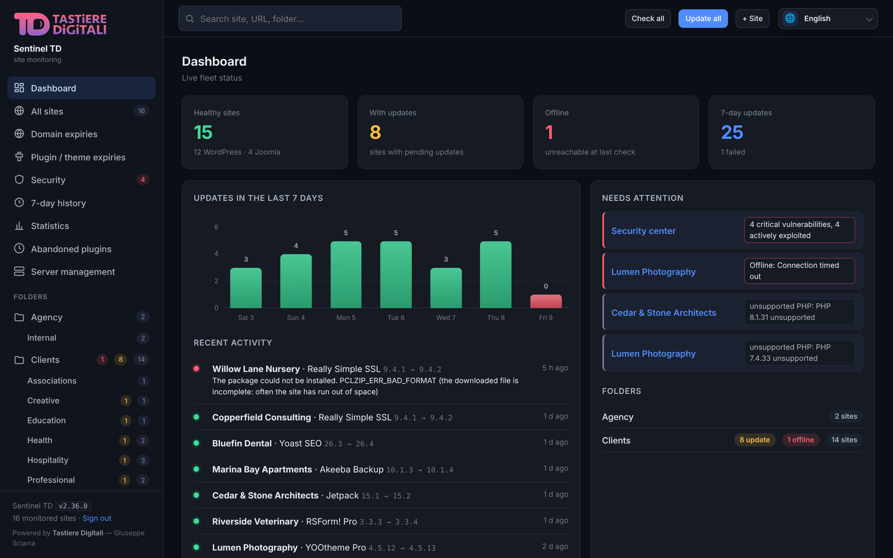

---

## Schermate

| | |
|---|---|
| **Tutti i siti** — stato, CMS, PHP, connettore, dominio, aggiornamenti in sospeso, una riga per sito<br>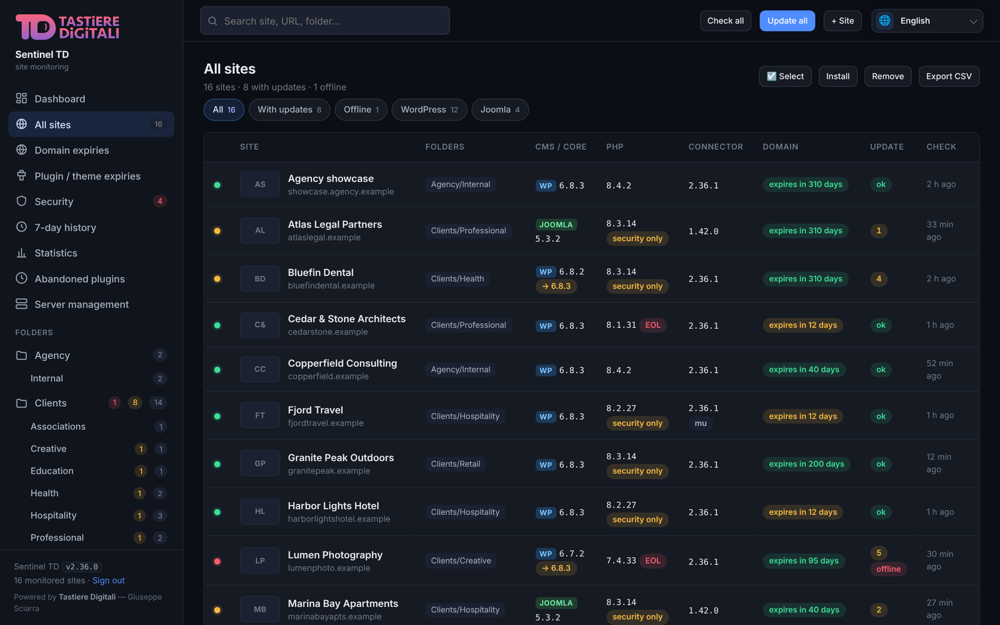 | **Pagina del sito** — stato, contatori, anteprima ed eventi recenti<br>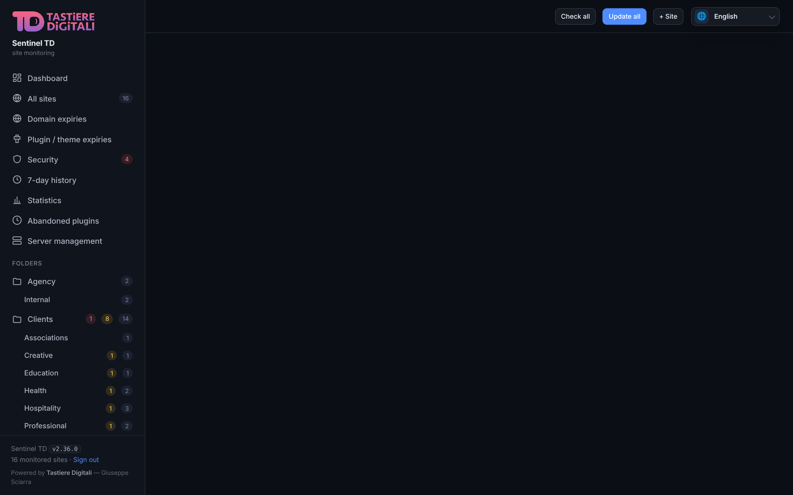 |
| **Estensioni** — plugin e temi con versione installata e disponibile, aggiornamento o blocco per ciascuno<br>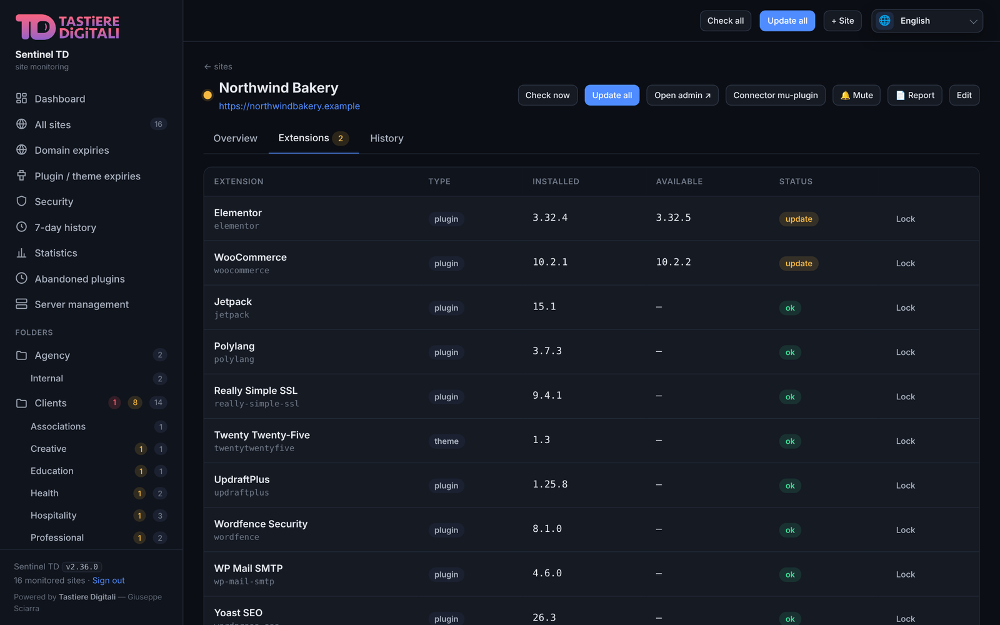 | **Centro sicurezza** — vulnerabilità note confrontate con quello che è davvero installato<br>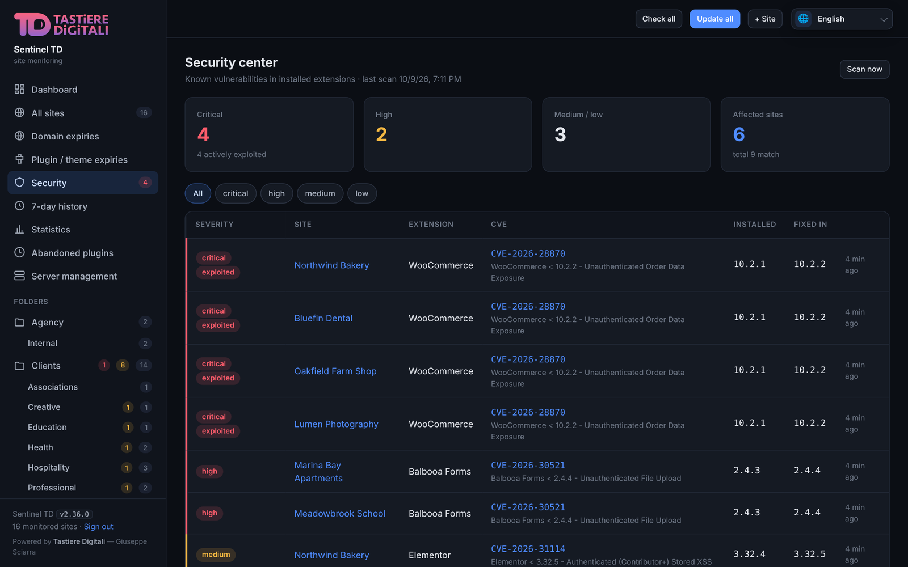 |
| **Storico aggiornamenti** — ogni aggiornamento con versioni, esito e ripristino<br>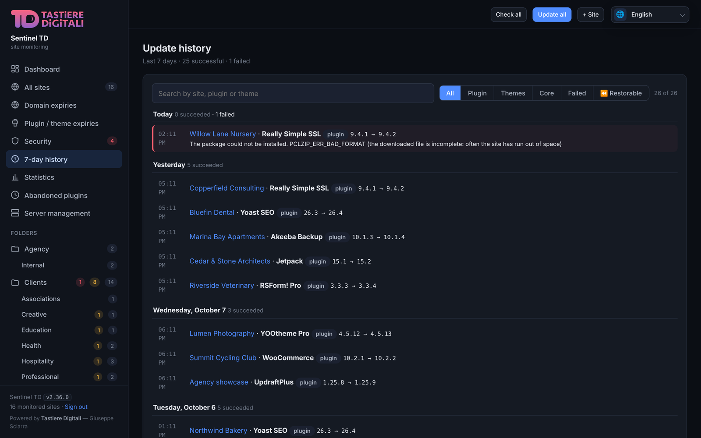 | **Statistiche** — andamento mensile, classifiche, confronti tra periodi, PDF<br>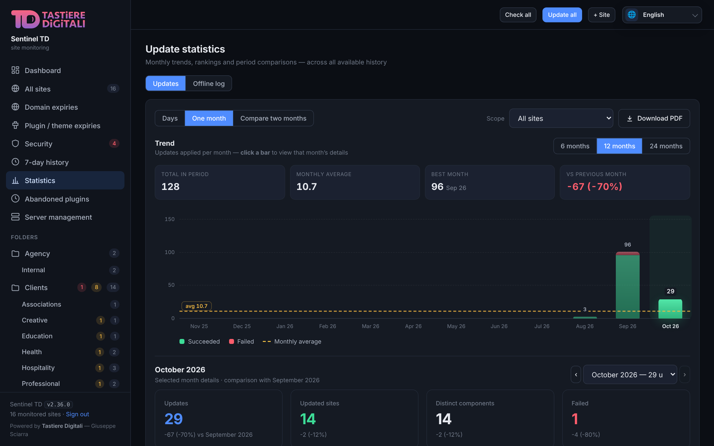 |
| **Scadenze domini** — registrar, scadenza e decisione rinnova / non rinnovare per dominio<br>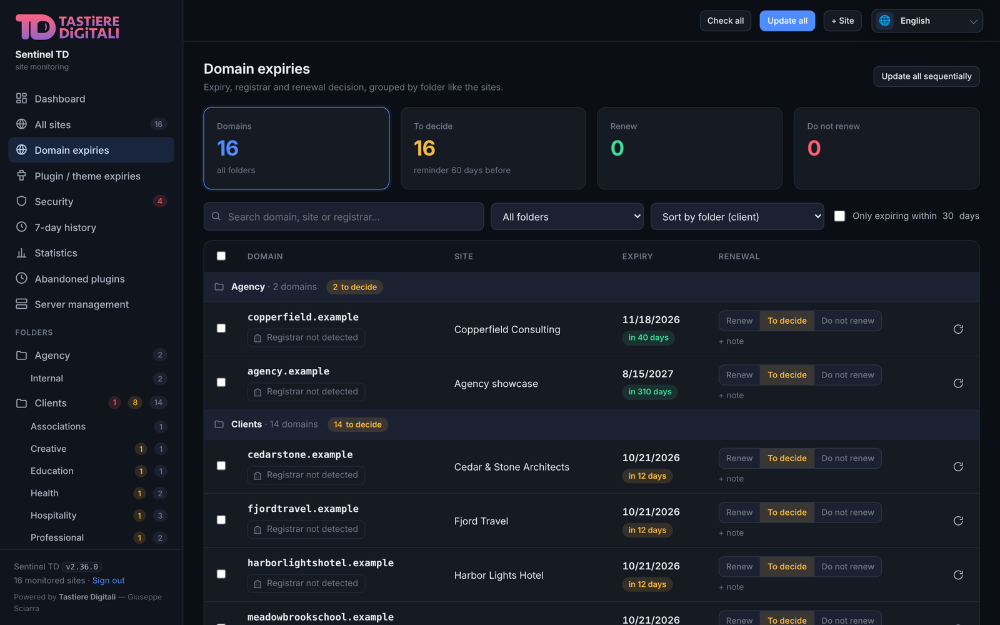 | **Notifiche** — ogni messaggio modificabile, con anteprima dal vivo e invio di prova<br>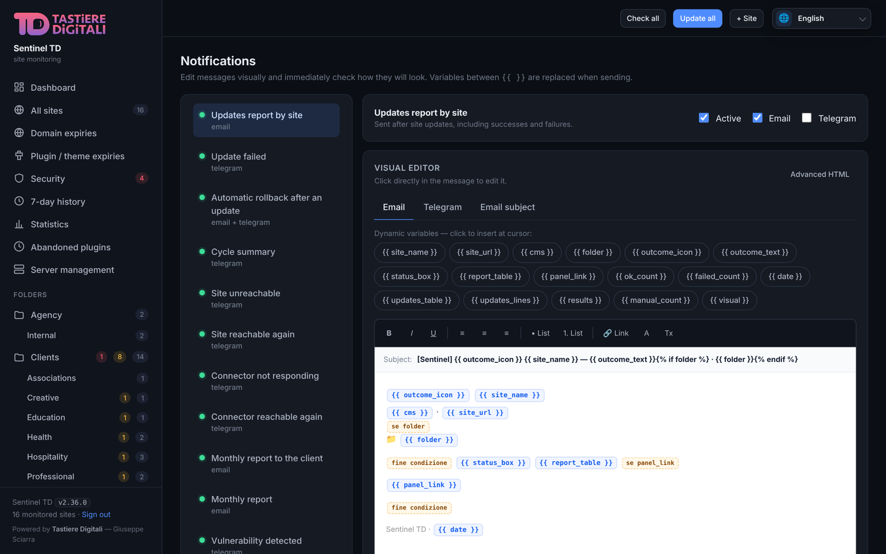 |
| **Registro** — tutto quello che Sentinel fa o vede, filtrabile per categoria, livello e periodo<br>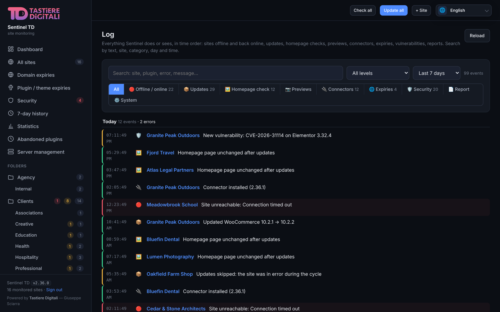 | **Impostazioni** — soglie, connettori, chiave di registrazione, indirizzo del pannello<br>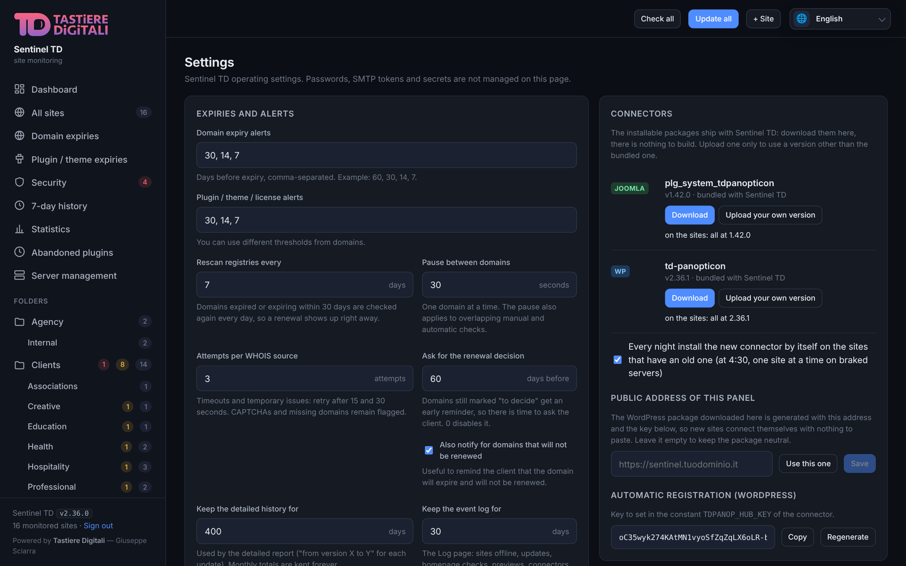 |

I dati mostrati sono un parco di prova con nomi inventati (interfaccia in inglese: il pannello è in italiano, inglese, francese e tedesco).

---

## Funzionalità

**Monitoraggio**
- Controlli di raggiungibilità con **conferma prima di gridare al lupo**: un sito risulta
  offline solo se non risponde per tutti i minuti che decidi tu (5 di base), così un server
  lento non ti sveglia di notte
- **Avviso "Connettore non risponde"** quando il sito è online ma il connettore no (rimosso,
  disattivato, token rifiutato): stessa finestra di conferma, avviso di ritorno quando risponde di nuovo
- Versioni di core, plugin, temi e traduzioni per ogni sito, tramite i connettori inclusi
- **Anteprima visiva di ogni sito**, rigenerata a intervalli, con le miniature nell'elenco
  (timer autonomo verificato ogni minuto; frequenza da Impostazioni, anche se la pagina non cambia).
  I siti abilitati senza anteprima o con anteprima scaduta vengono accodati anche all'avvio.
  Dopo un errore o un blocco antibot si ritenta all'intervallo impostato; l'ultima immagine
  riuscita conserva la propria data. L'esecuzione può slittare per l'attesa in coda
- Cartelle (clienti), tag, filtri rapidi, ricerca ed esportazione CSV
- **Spazio e log sotto controllo**: la diagnostica notturna scrive una prova da 50 MB su ogni sito ed
  elenca i log oltre i 10 MB, dentro il sito e nella cartella dell'account accanto (dove cPanel
  tiene `~/logs`). Una notifica per sito quando lo spazio scarseggia o compare un log grande, poi
  solo se cambia qualcosa

**Aggiornamenti**
- Aggiorni un sito, una selezione o tutto il parco — a mano o con il **ciclo automatico
  orario** (`AUTOUPDATE_ENABLED=true`), che ritenta quello che è fallito dopo una pausa (24 ore
  di base)
- **I pulsanti Aggiorna sono una richiesta esplicita**: partono anche se il sito ha gli
  aggiornamenti automatici spenti o un elemento è in pausa dopo un fallimento, e il pannello
  segue l'aggiornamento e ne mostra l'esito — "2 aggiornati, 1 fallito", "niente da aggiornare",
  "il sito non risponde: HTTP 401"
- **Installazione e rimozione in blocco** su più siti, guidata passo passo: piattaforma,
  pacchetto o estensione, poi i siti di destinazione anche per cartella. La rimozione
  raggiunge solo i siti che hanno davvero quell'estensione
- **L'installazione in blocco gira in sottofondo**: un lavoro per sito con l'avanzamento in
  diretta, prosegue anche se chiudi il browser (e la pagina lo riprende), e timeout o errori del
  server vengono ritentati un minuto dopo; gli errori veri (token rifiutato, zip rotto) si
  fermano subito
- **Freno per i server deboli**: i siti sono raggruppati per server (l'indirizzo IP del loro
  dominio), mostrati per cartella cliente col nome del server. Sui server col freno scegli quanti
  siti alla volta, quanto riposa il server dopo un sito e la pausa tra un aggiornamento e l'altro
  dello stesso sito; gli altri server lavorano come sempre
- Storico degli aggiornamenti con, per ogni componente, quante volte è stato aggiornato e
  da quale versione a quale
- **Controllo della home**: un'istantanea prima e dopo ogni aggiornamento; il report dice se
  il sito è uguale, se è cambiato vistosamente (istantanee allegate) o se si è rotto
- **Copia prima dell'aggiornamento e ripristino con un clic** (WordPress): prima di aggiornare un
  plugin o un tema il connettore zippa la versione attuale in `uploads/sentinel-backups/` (le
  ultime due per elemento, 14 giorni). Lo storico del sito mostra *Ripristina la x.y* su ogni
  aggiornamento con una copia. E se la home si rompe dopo un aggiornamento — un errore o un 5xx
  che prima non c'erano — Sentinel **ripristina da solo**, blocca quei componenti alla versione
  rimessa e te lo dice
- I prodotti a licenza (es. Elementor Pro) si aggiornano dall'interno del backend di
  WordPress; quando un sito non riesce a scaricarli, Sentinel installa lo zip che hai
  caricato una volta in *Pacchetti*
- **Prendi un pacchetto a licenza da un sito**: cerchi un plugin o un tema per nome tra i tuoi
  siti WordPress e prendi lo zip della versione più alta installata, pronto da installare sui
  siti a cui il produttore non lo consegna
- Elementor ed Elementor Pro si muovono insieme: Elementor non salta mai a una nuova
  versione principale lasciando indietro il Pro
- **Blocca un singolo plugin o tema** alla versione installata (pagina del sito → Estensioni →
  *Blocca*): non viene mai aggiornato, né in automatico né a mano, né contato tra quelli in sospeso,
  mentre il resto del sito continua ad aggiornarsi
- **Aggiorna solo Sentinel**: il connettore WordPress spegne gli aggiornamenti automatici di WordPress
  (core, plugin, temi, traduzioni) e toglie da Salute del sito il test "aggiornamenti in background",
  che altrimenti segnerebbe un problema critico falso. Dove `AUTOMATIC_UPDATER_DISABLED` è già
  impostata, o c'è il mu-plugin `td-site-health-tweaks.php`, quella parte non la tocca. Acceso di base,
  si spegne in *Impostazioni* (*Spegni gli aggiornamenti automatici di WordPress sui siti*): la scelta
  arriva a ogni sito al suo controllo successivo (connettore 2.38 o più recente)
- Dopo qualunque aggiornamento di plugin, temi o core il connettore WordPress **svuota da solo le
  cache del sito**, ognuna col suo comando ufficiale e solo se presente: CSS generati dai costruttori
  di pagine (Elementor, Essential Addons, Beaver Builder, Divi, Avada), cache di pagina (WP Rocket,
  W3 Total Cache, LiteSpeed, WP Super Cache, WP Fastest Cache, SiteGround, Breeze, Cache Enabler,
  Hummingbird, Nginx Helper, Autoptimize) e le opzioni nella cache degli oggetti — la causa delle
  pagine che si bloccano o perdono gli stili dopo un aggiornamento
- **YOOtheme Pro**, su WordPress e Joomla: dopo qualunque aggiornamento il connettore svuota la
  cache della configurazione di YOOtheme (builder, elementi, sorgenti dinamiche) — la cartella che
  svuota il suo pulsante *Svuota cache* — prima che YOOtheme la rilegga. La cache delle immagini
  resta intatta: rigenerare tutte le immagini ridimensionate dopo un aggiornamento non serve e
  peserebbe sui server deboli
- **Errori leggibili**: niente entità HTML, niente link di download coi token, niente righe di
  avanzamento — solo la frase che conta, con un suggerimento quando la causa probabile è lo
  spazio esaurito

**Sicurezza e scadenze**
- Vulnerabilità note confrontate con le estensioni realmente installate, con gravità e
  versione che risolve
- **Registro**: tutto quello che Sentinel fa o vede, in ordine di tempo — siti offline e tornati
  online, aggiornamenti, controlli della home, anteprime, connettori, scadenze, vulnerabilità,
  report — cercabile per testo, sito, categoria, giorno e ora; conservato per i giorni che imposti
- **Gestione server**: dove sta ogni sito, raggruppati per server (l'IP del dominio) con il nome che gli
  dai, un pulsante al pannello dell'hosting e un appunto; cerchi un sito e sai su che hosting sta.
  Nessuna statistica: sugli hosting non si misura niente
- **Plugin abbandonati**: tutti i plugin WordPress del parco con l'ultimo aggiornamento dell'autore,
  la versione "testato fino a" e le chiusure prese da wordpress.org (aggiornate ogni settimana) —
  plugin chiusi e plugin fermi da anni, con i siti che li usano ancora
- **Scadenza dei domini** via RDAP con ripiego su WHOIS, e avvisi alle soglie che decidi tu
- Per ogni dominio: **dove è registrato** (registrar e nameserver) e la **decisione di
  rinnovo** — da decidere, si rinnova, non si rinnova — anche in blocco, con le cartelle e
  un avviso in anticipo per avere il tempo di sentire il cliente
- Rinnovi di licenze e abbonamenti (temi, plugin, hosting) con periodicità e il pulsante
  *Rinnovata* che sposta la data avanti di un periodo

**Report e notifiche**
- Email e Telegram per ogni evento, con **testi modificabili**, anteprima dal vivo e invio
  di prova
- **Un riepilogo per ogni ciclo automatico** su Telegram: un blocco per sito con la sua cartella,
  core e componenti principali in cima, elenchi lunghi chiusi, e in testa quello da guardare —
  fallimenti col motivo, elementi in attesa, home cambiate. I riepiloghi lunghi si dividono tra
  un sito e l'altro, mai a metà di un sito. Per email: **un messaggio per sito** (esito e cartella
  nell'oggetto, comodi per le regole della posta) oppure **un riepilogo per ciclo**
- **Report mensile in PDF**, globale o uno per cartella, inviato in automatico nel giorno e
  all'orario che scegli (ore e minuti)
- **Stato dei siti** in ogni report: per ogni sito CMS e versione, PHP con lo stato del supporto,
  scadenza del dominio, peso e crescita dell'ultimo mese, database, spazio scrivibile e file del
  core, con in rosso i valori da guardare
- **Report per cliente**: ogni cliente riceve ogni mese il report dei **soli siti suoi**, ai suoi
  indirizzi — mai al tuo, mai su Telegram — firmato "Report di" con la tua ragione sociale. Siti e
  clienti sono molti-a-molti: di norma un sito per cliente, ma un **gruppo** (per esempio tutti i
  siti di un'agenzia) riceve un solo report per tutti i suoi siti, con un solo indirizzo. I clienti
  si creano dai siti (uno per sito, oppure un gruppo per un'intera cartella), si uniscono, si
  eliminano in blocco; i siti si aggiungono o tolgono da un gruppo, con l'**autocompletamento** su
  gruppi, clienti e cartelle. I report dei clienti hanno **impostazioni proprie** — invio
  automatico, giorno e orario, sezioni, testi e layout del PDF — separate dal tuo report mensile,
  con anteprima dal vivo su qualsiasi cliente
- **Report dettagliati su richiesta** (PDF o CSV) per un sito, una selezione o tutto, su un
  intervallo di mesi a scelta, con la cronologia di ogni singolo aggiornamento
- Statistiche con viste giornaliera, mensile e confronto fra due mesi, classifiche dei siti e
  dei componenti più aggiornati
- **Stato server**: una riga per server (o per cartella cliente) che si apre: siti, versioni PHP,
  **carico e RAM nelle ultime 24 ore** (valore di solito, picco con l'ora, grafico) e disco, peso con
  l'andamento di 30 giorni, aggiornamenti, domini e problemi di ogni sito, con le spiegazioni ⓘ; i server dietro lo stesso IP (per esempio un container WordPress e uno Joomla)
  si possono **dividere per macchina** dalle Impostazioni, ognuno con il suo carico, la sua RAM e il suo disco
- **Il pannello si aggiorna da solo**: pallini, etichette e la pagina del sito aperto seguono lo
  stato reale entro pochi secondi, senza ricaricare. Ogni 6 secondi il browser chiede un'impronta
  del parco di una riga (un `304` vuoto se nulla è cambiato) e scarica la lista solo quando serve
- Accesso con password, **TOTP** e **passkey**
- Personalizzazione: il tuo logo e la tua favicon nel pannello, nei PDF e nelle email
- Interfaccia in **italiano, inglese, francese e tedesco**, connettori compresi
- Pacchetti dei connettori generati dal pannello stesso, già col tuo indirizzo e la tua chiave
- **Connettore aggiornato da solo**: ogni notte il pannello installa il connettore che consegna sui
  siti che ne hanno uno più vecchio (un sito alla volta sui server col freno), e *Impostazioni →
  Connettori* mostra quali siti sono indietro, con *Aggiorna sui siti* per farlo subito.
  Si aggiornano solo le copie del connettore già presenti, nella loro cartella e senza attivarle:
  mai una copia nuova, mai il connettore installato come mu-plugin, nessun messaggio sul sito

---

## Requisiti

- Un server Linux con **Docker** e il plugin **Docker Compose**
- Un reverse proxy con HTTPS davanti al pannello (Nginx Proxy Manager, Traefik, Caddy, Nginx…)
- Accesso a internet in uscita, per raggiungere i siti monitorati e le fonti di vulnerabilità
- RAM per Chromium e la generazione dei PDF: 2 GB stanno comodi con qualche decina di siti

| Porta | Protocollo | Cosa |
|-------|------------|------|
| `HOST_PORT` (default 8810) | TCP | Pannello web — dietro il reverse proxy |

Tutto il resto (PostgreSQL, Redis, il servizio screenshot) resta sulla rete interna di Docker
e non viene mai esposto.

---

## Installazione

```bash
git clone https://github.com/Giuseppe-sciarra/SentinelTD.git
cd SentinelTD

# 1. Configurazione
cp .env.example .env
nano .env        # almeno: POSTGRES_PASSWORD, JWT_SECRET, ADMIN_PASSWORD, TZ

# 2. Avvio
docker compose up -d --build
docker compose logs -f api worker
```

Genera i segreti con:

```bash
docker run --rm python:3.12-slim python -c "import secrets; print(secrets.token_hex(32))"
```

`ADMIN_PASSWORD` deve avere almeno 12 caratteri: serve solo a creare il primo amministratore,
poi la password vive nel database e si cambia dal pannello.

Apri il pannello (`http://localhost:8810` per una prova locale) ed entra come `admin`.

### Con il reverse proxy su un'altra macchina

La porta è legata al loopback per impostazione predefinita. Se il proxy gira altrove nella
tua rete:

```dotenv
BIND_ADDRESS=0.0.0.0    # poi limita la porta 8810 all'indirizzo del proxy con un firewall
TZ=Europe/Rome          # update notturni, report e confini dei mesi seguono questo fuso
DEFAULT_UI_LANGUAGE=it  # lingua di email e PDF generati dal server
```

Per le passkey, `WEBAUTHN_RP_ID` è il solo nome host e `WEBAUTHN_ORIGIN` l'origine HTTPS esatta:

```dotenv
WEBAUTHN_RP_ID=sentinel.esempio.it
WEBAUTHN_ORIGIN=https://sentinel.esempio.it
```

---

## Collegare i siti

Ogni sito parla col pannello tramite un piccolo connettore. **Non devi crearlo tu**: i
pacchetti sono inclusi nell'applicazione.

1. *Impostazioni → Connettori* → imposta **Indirizzo pubblico di questo pannello** (il bottone
   **Usa questo** compila l'indirizzo da cui stai navigando)
2. Premi **Scarica** accanto a WordPress o Joomla. Il pacchetto WordPress viene generato con
   il tuo indirizzo e la tua chiave di registrazione dentro
3. Installalo sul sito e attivalo. Su WordPress vai in *Impostazioni → Sentinel TD*, scegli la
   cartella e premi **Collega**: il sito compare nel pannello, già accoppiato

Un sito si può aggiungere anche a mano: installi il pacchetto, copi il token che il connettore
mostra e lo incolli quando aggiungi il sito nel pannello. I sorgenti stanno in `connectors/` e
sono neutri — nessun indirizzo, nessuna chiave — così chiunque può costruirsi i propri;
vedi `connectors/README.md`.

*Prendi da un sito* richiede il **connettore 2.19 o successivo su WordPress**.

---

## Dove si imposta cosa

| Cosa | Dove |
|------|------|
| Logo, favicon, nome del pannello | Impostazioni → Branding |
| Rinominare una cartella | matita accanto alla cartella nella barra laterale |
| Zip di un plugin a licenza da installare ovunque | Impostazioni → Pacchetti |
| Prendere lo zip di un plugin o tema a licenza da un tuo sito | Impostazioni → Pacchetti → Prendi da un sito |
| Dopo quanti minuti avvisare che un sito non risponde | Impostazioni → Avvisa che un sito non risponde dopo |
| Soglie di scadenza, frequenza scansioni, anteprime, conservazione cronologia | Impostazioni |
| Indirizzo del pannello e chiave di registrazione per i connettori | Impostazioni → Connettori |
| Un'email per sito oppure un riepilogo per ciclo automatico | Impostazioni → Email dei report di aggiornamento |
| Testi, HTML e canali di ogni notifica | Notifiche |
| Report mensile: giorno e orario, destinatario, contenuto, impaginazione | Report mensile |
| Clienti, i loro siti e indirizzi, gruppi, report automatico al cliente | Report clienti |
| Report dei clienti: invio, giorno e orario, sezioni, testi, layout del PDF (uniche per tutti i clienti) | Report clienti → Impostazioni |
| Testo dell'email che accompagna il report al cliente | Notifiche → Report mensile al cliente |
| Freno sui server deboli (siti alla volta, riposo, pausa tra gli aggiornamenti) | Impostazioni → Server dei siti |
| Credenziali database, SMTP, Telegram, segreti, porte | `.env` |

---

Le risorse dei server (carico CPU, RAM e disco) vengono rilevate con un timer autonomo,
ogni 5 minuti di base, configurabile in Impostazioni. La pagina Stato server si ricarica
ogni 30 secondi mentre è visibile. Ogni risorsa mostra quanto è recente la misura.
Lo storico delle risorse è persistente in PostgreSQL: rimane disponibile anche dopo
la ricreazione dei container o di Redis. Il grafico mostra le ultime 24 ore.

## Aggiornamenti

```bash
git pull --ff-only
docker compose up -d --build
docker compose ps
```

Le migrazioni del database partono da sole all'avvio. Se sostituisci i file a mano invece di
usare Git, ricostruisci entrambi i servizi che condividono il contesto di build:

```bash
docker compose up -d --build api worker
```

---

## Backup

Salva insieme:

- i dati di PostgreSQL (`pg_data`)
- i volumi `branding`, `connectors` e `screenshots`
- il tuo `.env` privato

```bash
docker compose exec -T postgres pg_dump -U "$POSTGRES_USER" "$POSTGRES_DB" > sentinel-$(date +%F).sql
```

Un normale `docker compose down` conserva i volumi. **`docker compose down -v` li cancella**, e
con loro storico e impostazioni.

---

## Se qualcosa non va

- **Un sito risulta offline ma funziona (HTTP 401 `rest_forbidden`)** — il sito risponde ma il
  connettore rifiuta il token, di solito perché è stato rimosso e reinstallato. Sul sito,
  *Impostazioni → Sentinel TD → Collega questo sito a Sentinel TD* riallinea il token da solo;
  in alternativa ricopialo in *Modifica*. Gli hosting che scartano l'header `Authorization`
  sono coperti dal connettore 2.18.2, che accetta il token anche in `X-Sentinel-Token`.
- **Gli aggiornamenti falliscono su più siti insieme** — quasi sempre è DNS o filesystem, non il
  pannello. `docker compose logs worker | grep "UPDATE FALLITO"` mostra il motivo vero
  restituito da ogni sito.
- **Un aggiornamento fallisce con `PCLZIP_ERR_BAD_FORMAT` o "spazio insufficiente"** — probabilmente
  è piena la quota dell'hosting, anche se il disco del server non lo è. Nella pagina del sito,
  *Esegui diagnostica* scrive dati veri sul sito e dice quanto spazio è davvero scrivibile.
- **Gli aggiornamenti vanno in timeout su un hosting condiviso economico** — metti il freno a quel
  server in *Impostazioni → Server dei siti*: meno siti alla volta, un riposo dopo ogni sito e una
  pausa più lunga tra un aggiornamento e l'altro dello stesso sito.
- **Nessuna anteprima, o un rettangolo bianco dove c'è un video** — il servizio screenshot ha
  bisogno di Google Chrome per i video di sfondo in H.264:
  `docker compose logs shooter | grep pronto` deve nominare Chrome. Se è ripiegato su Chromium,
  ricostruisci con `docker compose build shooter`.
- **Email o PDF nella lingua sbagliata** — seguono `DEFAULT_UI_LANGUAGE`, non la lingua scelta
  nel browser.
- **Le cose programmate scattano all'ora sbagliata** — imposta `TZ` nel `.env`; senza, i
  container girano in UTC.

---

## Documentazione

- `CHANGELOG.md` — note di rilascio
- `SECURITY.md` — come segnalare una vulnerabilità
- `THIRD-PARTY.md` — componenti di terze parti e relative licenze
- `connectors/README.md` — i connettori WordPress e Joomla
- `docs/LANGUAGES.md` — manutenzione delle traduzioni

---

## Licenza

Sentinel TD è software libero rilasciato sotto
**GNU Affero General Public License v3.0 o successiva** — vedi [LICENSE](LICENSE).

In breve: puoi usarlo, modificarlo e ridistribuirlo, anche commercialmente. Se offri una
versione **modificata** come servizio di rete ad altre persone, devi mettere a disposizione
di quegli utenti il codice sorgente.

I componenti di terze parti e le loro licenze sono elencati in [THIRD-PARTY.md](THIRD-PARTY.md).

Copyright © Giuseppe Sciarra — [Tastiere Digitali](https://tastieredigitali.it)

---

## Sostieni il progetto

Se Sentinel TD ti è utile, puoi sostenerne lo sviluppo con una donazione:

**[paypal.me/raxiel87](https://paypal.me/raxiel87)**

Segnalazioni di bug e pull request sono benvenute.
